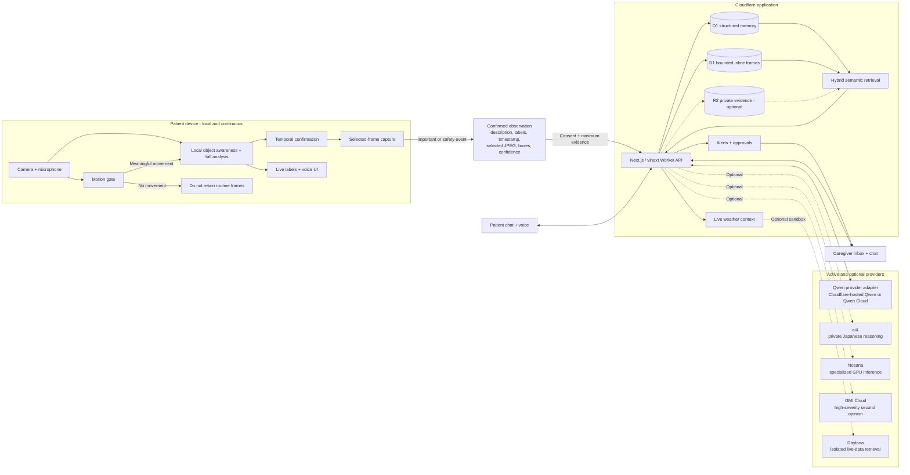
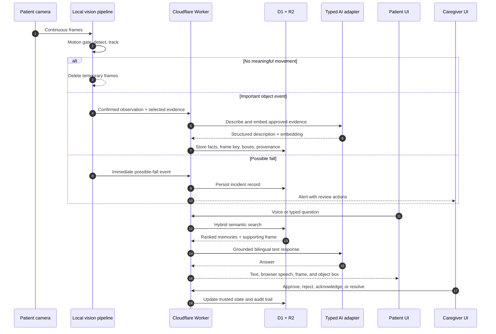

<div align="center">
  <picture>
    <source media="(prefers-color-scheme: dark)" srcset="./public/brand/mark-white-transparent.png">
    <source media="(prefers-color-scheme: light)" srcset="./public/brand/mark-black-transparent.png">
    
  </picture>

  # TOMO

  **A familiar voice. A trusted connection.**

  A privacy-first, voice-first memory and safety companion for older adults and their care circle.

  [](https://nextjs.org/)
  [](https://tomo-3aw.pages.dev)
  [](https://www.typescriptlang.org/)
  [](./LICENSE)
</div>

**Live application:** [tomo-3aw.pages.dev](https://tomo-3aw.pages.dev) · **API health:** [tomo-3aw.pages.dev/api/health](https://tomo-3aw.pages.dev/api/health)

## What TOMO does

TOMO helps a patient remember where objects were placed, understand today’s routine, talk naturally in English or Japanese, and contact a trusted caregiver. It also gives caregivers an evidence-focused view for possible falls, sensitive-memory approvals, reminders, and household context.

The defining privacy rule is simple:

> **Continuous video stays on the patient’s device. Only significant, consent-approved event evidence reaches cloud storage and semantic memory.**

TOMO is assistive software, not a medical device. It reports a **possible fall**, never a diagnosis, and does not automatically dispatch emergency services.

## Product experience

### Patient

- Opens directly into a calm, centered voice experience.
- Starts the local camera after browser consent and keeps monitoring while minimized.
- Shows current object labels and bounding boxes only while the camera sees them.
- Answers questions such as “Where are my glasses?” from the newest trusted observation, with a retained frame, label, time, and spoken response when available.
- Recognizes household objects through one camera-awareness pipeline; personal items are detected only after movement to control heat, latency, and battery use.
- If the same observation is requested again, acknowledges the earlier answer and asks whether the object is still missing; a newer observation always replaces the old answer.
- Keeps `Call Yuki` prominent as a familiar human fallback.
- Sends medicine, schedule, and other sensitive memories to caregiver approval before trusting them.

### Caregiver

- Opens into a care inbox containing only real stored alerts and approval requests—no seeded incident.
- Can acknowledge or resolve a real incident.
- Approves or rejects patient-submitted sensitive memories.
- Uses the same chat interface to retrieve evidence or add trusted semantic memory.
- Can configure the caregiver phone number locally from the patient’s `Call Yuki` dialog.

## System design



### Runtime communication



### Communication model

1. **Fast local lane:** the camera, motion gate, object detector, temporal checks, and bounding-box rendering run in the browser. This path never waits for cloud AI.
2. **Safety lane:** a fall-like posture must persist across time before TOMO creates a possible-fall event. The immediate caregiver alert is separate from slower video enrichment.
3. **Memory lane:** only confirmed important observations leave the live frame stream. Object memories retain a bounded JPEG, coordinates, structured facts, and provenance in D1. Confirmed possible-fall alerts retain a bounded marked JPEG in D1 and attach the preceding local event window through private R2.
4. **Retrieval lane:** explicit glasses/keys questions select the newest trusted observation first. TOMO records a retrieval receipt; asking again against the same observation produces a gentle follow-up, while a newer observation replaces it. Other questions use hybrid lexical/vector retrieval and Qwen grounding.
5. **Approval lane:** caregiver memories are trusted immediately. Sensitive patient statements remain pending until a caregiver approves or edits them.
6. **Voice lane:** compatible browsers provide English/Japanese speech recognition and synthesis; typed chat is always available. Provider-grade realtime voice is not implemented yet.

## Memory capture contract

When movement triggers a confirmed glasses/keys observation, TOMO selects a bounded supporting frame and produces this contract. Full five-second clip retention is the next R2-backed step and is not claimed as active today.

```ts
type MemoryEvent = {
  description: string
  objectLabels: string[]
  occurredAt: string
  bestFrameKey?: string
  evidenceDataUrl?: string
  boxes: Array<{
    label: string
    confidence: number
    x: number
    y: number
    width: number
    height: number
  }>
  videoKey?: string
  embeddingModel?: string
  embedding?: number[]
  importance: "routine" | "important" | "safety"
  approvalState: "trusted" | "pending" | "rejected"
  provenance: "camera" | "patient" | "caregiver"
}
```

Routine frames are not retained. Retained JPEGs are capped before entering D1. Event clips use private R2 object keys and household-scoped retrieval; production authentication and automated lifecycle expiry remain required before real patient use.

## Technology stack

| Layer | Technology | Purpose |
|---|---|---|
| Web application | Next.js 16, React 19, TypeScript | One responsive patient/caregiver application |
| Cloudflare runtime | vinext, Cloudflare Workers | Low-cost edge rendering and API execution |
| UI | shadcn/ui preset `b1VlIugq`, Base UI, Lucide | Strict, accessible component vocabulary |
| Local vision | Compact ONNX detector, motion-gated open-vocabulary fallback, ONNX Runtime Web | Fast local boxes with WebGPU/WASM fallback |
| Fall analysis | Specialized posture model + person geometry + temporal consensus | Requires a visible person, recent motion, rapid posture change or strong model evidence, and sustained low posture |
| Structured storage | Cloudflare D1, Drizzle ORM | Memories, alerts, approvals, schedule, audit |
| Evidence storage | Bounded D1 data URLs; Cloudflare R2 adapter | Current selected frames; private clips when the optional R2 binding is enabled |
| Semantic memory | Qwen embeddings + D1 hybrid ranking | English/Japanese evidence retrieval |
| Voice | Browser Web Speech + typed provider boundary | Bilingual ASR/TTS with typed-chat fallback |
| Deployment | Cloudflare Pages advanced mode + GitHub | Public HTTPS UI and edge API |

## Sponsor tools — honest integration status

| Tool | Intended role | Current status |
|---|---|---|
| **Qwen Cloud** | Direct hosted Qwen chat and embeddings through the typed OpenAI-compatible adapter | Adapter implemented; disabled until `DASHSCOPE_API_KEY` and `QWEN_BASE_URL` are supplied |
| **ai&** | Privacy-sensitive Japanese reasoning and patient-safe phrasing | Not configured; optional |
| **Nosana** | Specialized/custom model inference when local hardware is insufficient | Not configured; optional |
| **GMI Cloud** | Independent review of ambiguous high-severity evidence | Not configured; optional |
| **Daytona** | Isolated retrieval of allowlisted live information | Not configured; weather currently uses Open-Meteo directly |
| **Qoder** | Architecture review, Repo Wiki, implementation and test support | Development-only tool; not a runtime dependency |

The deployed application currently runs Qwen chat and embeddings through the **Cloudflare Workers AI binding** (`@cf/qwen/qwen3-30b-a3b-fp8` and `@cf/qwen/qwen3-embedding-0.6b`). This is a real Qwen integration, but it is not presented as the Qwen Cloud sponsor API. If Qwen Cloud credentials are added, the same adapter prefers them without changing route contracts.

Typed chat and local camera analysis continue independently of optional sponsor providers. A durable notification outbox is still required before production use.

## Repository structure

```text
app/                         Next.js application shell
components/
  tomo-experience.tsx        Patient and caregiver experiences
  live-camera-provider.tsx   Persistent camera + YOLO, OWL-ViT and fall runtime
  ui/                        shadcn/ui components only
db/                          Drizzle schema and D1 access
drizzle/                     Generated database migrations
public/
  brand/                     TOMO light/dark logo assets
  yolo26n.onnx               Local object detector
worker/                      Cloudflare Worker entry point
scripts/prepare-pages.mjs    Reproducible Pages advanced-mode bundle
scripts/verify-production.mjs Live API integration verifier
wrangler.jsonc               Pages, D1, and Workers AI bindings
tests/                       Build and rendered-output checks
```

## Current implementation status

This repository is under active construction. The README describes the approved final architecture; the table below distinguishes what is already working from the next production gates.

| Capability | Status |
|---|---|
| Native Cloudflare Pages deployment | **Live** |
| Patient and caregiver responsive UI | **Live** |
| Strict shadcn `b1VlIugq` design system | Working |
| Persistent camera while minimized | Working |
| Phone camera defaults to front-facing | Working |
| Live YOLO26n labels and bounding boxes | Working locally |
| Motion-gated glasses/keys recognition | Working locally with OWL-ViT and 2-of-3 confirmation |
| English/Japanese browser speech input/output | Working on compatible browsers |
| Temporal Project Memoria fall model and D1 alert trigger | Working locally; visible-person gate, stronger-upright suppression, temporal consensus, geometry fallback, and 10-minute deduplication |
| Motion-gated selected-frame capture | **Live** for confirmed glasses/keys observations |
| Rolling local event buffer and protected fall clip | Working; six one-second chunks are held locally and uploaded to private R2 only after confirmation |
| D1 structured + hybrid semantic memory | **Live** |
| D1 fall-alert status and caregiver approval workflow | **Live** |
| Cloudflare-hosted Qwen chat and embeddings | **Live** |
| Qwen Cloud sponsor API | Adapter ready; credentials unavailable |
| R2 evidence upload | Working with private `EVIDENCE` binding and household-scoped retrieval |
| Email delivery | Adapter ready; sender credentials unavailable |
| Authentication and household grants | Future production gate |

Until authentication is added, public testing must use fictional, non-sensitive information only. Browser-generated guest household IDs isolate browser sessions; they are not identity or authorization.

## Run locally

### Requirements

- Node.js 22.13 or newer
- pnpm 11
- Chromium, Chrome, Edge, or another browser with `getUserMedia`
- Camera access on `localhost` or HTTPS

```bash
git clone https://github.com/ksmostofa/tomo.git
cd tomo
pnpm install
pnpm dev
```

Open [http://localhost:3000](http://localhost:3000), allow camera access, and open the patient camera card. ONNX Runtime prefers WebGPU and falls back to WebAssembly.

### Quality checks

```bash
pnpm lint
pnpm typecheck
pnpm build
pnpm test
```

After deploying, run the live API verifier against a non-sensitive environment, then remove its generated `verify_*` household from D1:

```bash
pnpm verify:production
```

## shadcn constraint

TOMO intentionally uses one interface vocabulary. Do not add a second component system, custom color palette, or decorative animation library.

```bash
pnpm dlx shadcn@latest init --preset b1VlIugq --template next --pointer
```

Use shadcn components, semantic theme tokens, CSS transitions, and accessible HTML/SVG evidence overlays.

## Cloudflare deployment

The checked-in `wrangler.jsonc` targets the existing TOMO resources. For a fork, create your own D1 database and replace its ID:

```bash
pnpm install
pnpm exec wrangler login
pnpm exec wrangler d1 create tomo-memoria-db
# Copy the returned database_id into wrangler.jsonc.
pnpm exec wrangler d1 execute tomo-memoria-db --remote --file=drizzle/0000_naive_zarek.sql
pnpm deploy:pages
```

To enable private evidence, first enable R2 in the Cloudflare account, create `tomo-memoria-evidence`, then add an `r2_buckets` binding named `EVIDENCE` to `wrangler.jsonc`. Add secrets with `wrangler pages secret put`; never commit them. Verify `/api/health`, the camera on HTTPS, guest isolation, and evidence retention after each deployment.

Target environment names:

```text
DASHSCOPE_API_KEY
QWEN_BASE_URL
QWEN_CHAT_MODEL
QWEN_EMBEDDING_MODEL
RESEND_API_KEY
EMAIL_FROM
CAREGIVER_EMAIL
```

Only variables used by an implemented provider should be configured. Optional sponsor adapters have their own isolated secrets and health checks.

## Safety, privacy and accessibility

- Explicit camera and microphone permission.
- Local-first continuous vision; no continuous cloud stream.
- Minimum necessary evidence and bounded retention.
- Household-scoped reads and writes.
- Signed/private evidence access is required before R2 evidence is enabled.
- “Possible fall” language with visible uncertainty.
- Caregiver acknowledgement before closing incidents.
- WCAG 2.2 AA targets, keyboard support, visible focus, captions, reduced motion and 200% zoom.
- No face recognition, emotion diagnosis, autonomous emergency dispatch, or hidden background recording.

## Acknowledgements

TOMO’s fall-event concepts and parts of its temporal capture approach are informed by [Project Memoria](https://github.com/gamefreakoneone/Project-Memoria_Dementia-Assistant), used under its MIT license. YOLO models and Ultralytics tooling are subject to the [Ultralytics licensing terms](https://www.ultralytics.com/license). Review model and dependency licenses before commercial distribution.

## License

The TOMO application code is available under the [MIT License](./LICENSE). Third-party models, runtimes, fonts, icons, and services retain their own licenses and terms.
