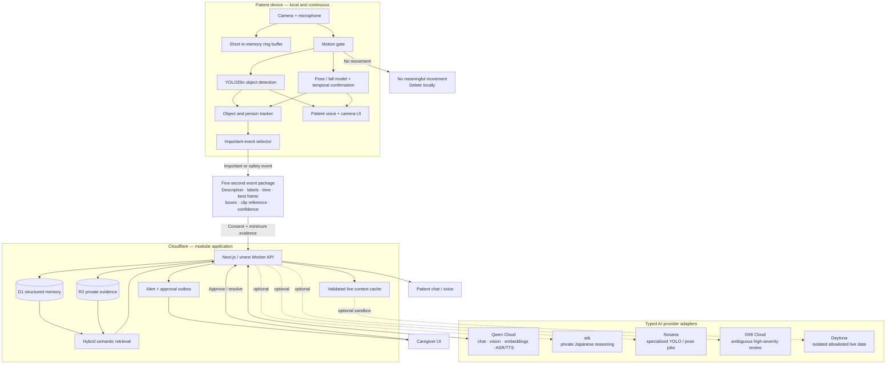

<div align="center">
  <picture>
    <source media="(prefers-color-scheme: dark)" srcset="./public/brand/mark-white-transparent.png">
    <source media="(prefers-color-scheme: light)" srcset="./public/brand/mark-black-transparent.png">
    
  </picture>

  # TOMO

  **A familiar voice. A trusted connection.**

  A privacy-first, voice-first memory and safety companion for older adults and their care circle.

  [](https://nextjs.org/)
  [](https://www.cloudflare.com/)
  [](https://www.typescriptlang.org/)
  [](./LICENSE)
</div>

## What TOMO does

TOMO helps a patient remember where objects were placed, understand today’s routine, talk naturally in English or Japanese, and contact a trusted caregiver. It also gives caregivers an evidence-focused view for possible falls, sensitive-memory approvals, reminders, and household context.

The defining privacy rule is simple:

> **Continuous video stays on the patient’s device. Only significant, consent-approved event evidence reaches cloud storage and semantic memory.**

TOMO is assistive software, not a medical device. It reports a **possible fall**, never a diagnosis, and does not automatically dispatch emergency services.

## Product experience

### Patient

- Opens directly into a calm, centered voice experience.
- Starts the local camera after browser consent and keeps monitoring while minimized.
- Shows real YOLO labels and bounding boxes only for current detections.
- Answers questions such as “Where are my glasses?” with a grounded frame, label, time, and spoken response.
- Keeps `Call Yuki` prominent as a familiar human fallback.
- Sends medicine, schedule, and other sensitive memories to caregiver approval before trusting them.

### Caregiver

- Opens into a care inbox with possible-fall evidence, confidence, timeline, and actions.
- Can acknowledge, call, resolve, or review an incident.
- Approves, edits, or rejects patient-submitted sensitive memories.
- Uses the same chat interface to retrieve evidence or add trusted semantic memory.
- Manages schedules, contacts, privacy settings, and camera health.

## System design



### Communication model

1. **Fast local lane:** the camera, motion gate, YOLO, tracker, rolling buffer, and bounding-box rendering run in the browser. This path never waits for cloud AI.
2. **Safety lane:** a fall-like posture must persist across time before TOMO creates a possible-fall event. The immediate caregiver alert is separate from slower video enrichment.
3. **Memory lane:** only important motion windows are summarized. The selected frame and coordinates are stored in R2; structured facts and provenance are stored in D1.
4. **Retrieval lane:** chat creates an intent, searches filtered lexical and vector candidates, retrieves evidence, and returns a concise answer with confidence and proof.
5. **Approval lane:** caregiver memories are trusted immediately. Sensitive patient statements remain pending until a caregiver approves or edits them.
6. **Voice lane:** an English/Japanese `VoiceRealtime` adapter streams ASR and TTS. Typed chat remains the fallback when realtime voice is unavailable.

## Five-second memory capture

When motion becomes meaningful, TOMO keeps the relevant part of its local rolling buffer and produces this contract:

```ts
type MemoryEvent = {
  description: string
  objectLabels: string[]
  occurredAt: string
  bestFrameKey: string
  boxes: Array<{
    label: string
    confidence: number
    x: number
    y: number
    width: number
    height: number
  }>
  videoKey?: string
  embeddingModel: string
  embedding: number[]
  importance: "routine" | "important" | "safety"
  approvalState: "trusted" | "pending" | "rejected"
  provenance: "camera" | "patient" | "caregiver"
}
```

Routine, no-motion footage expires locally. Evidence uploads use short retention, private object keys, household isolation, and an audit trail.

## Technology stack

| Layer | Technology | Purpose |
|---|---|---|
| Web application | Next.js 16, React 19, TypeScript | One responsive patient/caregiver application |
| Cloudflare runtime | vinext, Cloudflare Workers | Low-cost edge rendering and API execution |
| UI | shadcn/ui preset `b1VlIugq`, Base UI, Lucide | Strict, accessible component vocabulary |
| Local vision | YOLO26n ONNX, ONNX Runtime Web | Live object boxes with WebGPU/WASM fallback |
| Fall analysis | Specialized fall model + temporal tracker | Conservative possible-fall events |
| Structured storage | Cloudflare D1, Drizzle ORM | Memories, alerts, approvals, schedule, audit |
| Evidence storage | Cloudflare R2 | Best frames and short event clips |
| Semantic memory | Qwen embeddings + hybrid search | English/Japanese evidence retrieval |
| Voice | Typed realtime ASR/TTS provider adapter | Bilingual streaming conversation and fallback |
| Deployment | Cloudflare Sites/Workers + GitHub | Public HTTPS delivery and reproducible source |

## Sponsor tools — used only where they belong

| Tool | Role | Runtime requirement |
|---|---|---|
| **Qwen Cloud** | Primary chat, vision confirmation, embeddings, English/Japanese ASR and TTS | Core provider adapter |
| **ai&** | Privacy-sensitive Japanese reasoning and patient-safe phrasing | Optional adapter |
| **Nosana** | Specialized/custom YOLO and pose processing when local hardware is insufficient | Optional GPU lane |
| **GMI Cloud** | Independent review of ambiguous high-severity evidence; never cancels a deterministic alert | Optional second opinion |
| **Daytona** | Isolated retrieval of allowlisted live information such as weather | Optional context sandbox |
| **Qoder** | Architecture review, Repo Wiki, implementation and test support | Development only |

Provider failures are explicit and recoverable. TOMO must retain typed-chat fallback, local safety behavior, and durable outbox state when a provider is unavailable.

## Repository structure

```text
app/                         Next.js application shell
components/
  tomo-ui-prototype.tsx      Patient and caregiver experiences
  live-camera-provider.tsx   Persistent camera + local YOLO runtime
  ui/                        shadcn/ui components only
db/                          Drizzle schema and D1 access
drizzle/                     Generated database migrations
public/
  brand/                     TOMO light/dark logo assets
  yolo26n.onnx               Local object detector
worker/                      Cloudflare Worker entry point
.openai/hosting.json         Cloudflare D1/R2 binding declaration
tests/                       Build and rendered-output checks
```

## Current implementation status

This repository is under active construction. The README describes the approved final architecture; the table below distinguishes what is already working from the next production gates.

| Capability | Status |
|---|---|
| Patient and caregiver responsive UI | Working prototype |
| Strict shadcn `b1VlIugq` design system | Working |
| Persistent camera while minimized | Working |
| Live YOLO26n labels and bounding boxes | Working locally |
| English/Japanese UI affordances | Working prototype |
| Temporal fall model and alert trigger | In progress |
| Motion-gated five-second event capture | In progress |
| D1/R2 semantic memory | Planned integration |
| Qwen chat, vision, embeddings and voice | Planned integration |
| Email and caregiver notification delivery | Planned integration |
| Authentication and household grants | Future production gate |

Until authentication is added, public testing must use synthetic/demo information only. Browser-generated guest household IDs will isolate test sessions; they are not a substitute for identity or authorization.

## Run locally

### Requirements

- Node.js 22.13 or newer
- pnpm 11
- Chromium, Chrome, Edge, or another browser with `getUserMedia`
- Camera access on `localhost` or HTTPS

```bash
git clone https://github.com/ksmostofa/tomo.git
cd tomo
pnpm install
pnpm dev
```

Open [http://localhost:3000](http://localhost:3000), allow camera access, and open the patient camera card. ONNX Runtime prefers WebGPU and falls back to WebAssembly.

### Quality checks

```bash
pnpm lint
pnpm build
pnpm test
```

## shadcn constraint

TOMO intentionally uses one interface vocabulary. Do not add a second component system, custom color palette, or decorative animation library.

```bash
pnpm dlx shadcn@latest init --preset b1VlIugq --template next --pointer
```

Use shadcn components, semantic theme tokens, CSS transitions, and accessible HTML/SVG evidence overlays.

## Cloudflare deployment

1. Create a Cloudflare site/project.
2. Bind D1 as `DB` and R2 as `EVIDENCE` in `.openai/hosting.json`.
3. Apply generated Drizzle migrations.
4. Add provider credentials as encrypted deployment secrets—never `.env` files committed to Git.
5. Build and deploy from the pinned GitHub commit.
6. Verify camera access on the production HTTPS URL, provider health, guest isolation, and evidence retention.

Target environment names:

```text
DASHSCOPE_API_KEY
QWEN_BASE_URL
QWEN_TEXT_MODEL
QWEN_VISION_MODEL
QWEN_EMBED_MODEL
ALERT_EMAIL_FROM
CAREGIVER_EMAIL
```

Only variables used by an implemented provider should be configured. Optional sponsor adapters have their own isolated secrets and health checks.

## Safety, privacy and accessibility

- Explicit camera and microphone permission.
- Local-first continuous vision; no continuous cloud stream.
- Minimum necessary evidence and bounded retention.
- Household-scoped reads and writes.
- Signed/private evidence access.
- “Possible fall” language with visible uncertainty.
- Caregiver acknowledgement before closing incidents.
- WCAG 2.2 AA targets, keyboard support, visible focus, captions, reduced motion and 200% zoom.
- No face recognition, emotion diagnosis, autonomous emergency dispatch, or hidden background recording.

## Acknowledgements

TOMO’s fall-event concepts and parts of its temporal capture approach are informed by [Project Memoria](https://github.com/gamefreakoneone/Project-Memoria_Dementia-Assistant), used under its MIT license. YOLO models and Ultralytics tooling are subject to the [Ultralytics licensing terms](https://www.ultralytics.com/license). Review model and dependency licenses before commercial distribution.

## License

The TOMO application code is available under the [MIT License](./LICENSE). Third-party models, runtimes, fonts, icons, and services retain their own licenses and terms.
