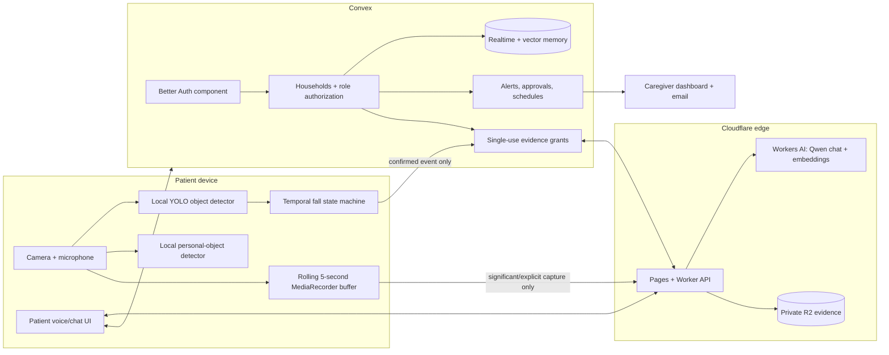

# tomo

> A familiar voice, close by.

TOMO is a privacy-first bilingual memory and safety companion for people living with memory loss and the caregivers they trust. It combines continuous on-device perception, evidence-backed semantic memory, natural voice/chat, schedules, approvals, and caregiver fall alerts in one responsive web application.

## What works

- Separate patient and caregiver accounts with first-run role selection
- Ten-minute, hashed, single-use pairing codes for separate devices
- Household authorization enforced inside every Convex function
- Front-camera startup on patient devices; caregiver devices never request camera access
- Local YOLO object detection with live labels and bounding boxes
- Local glasses and keys recognition with compatible WebGPU/WASM fallback
- Temporal possible-fall confirmation requiring a visible person, sustained evidence, and recent motion
- Rolling five-second local segments; ordinary footage is discarded
- Manual five-second memory capture with frame, clip, labels, boxes, timestamp, and embedding
- Fresh immutable fall evidence and real-time caregiver incident updates
- Private R2 media through expiring, single-use read/write grants
- Latest-observation semantic retrieval with repeat-aware answers
- Natural context capture; patient facts require caregiver approval
- English/Japanese chat, browser speech recognition, and spoken patient answers
- Caregiver-created schedules, live weather guidance, and Call Yuki
- In-app approvals plus idempotent caregiver email delivery

## Architecture



### Communication paths

1. The patient signs in and selects the patient role. The browser starts the front camera only after authenticated onboarding.
2. General objects are labeled locally immediately. Glasses/keys detection runs only around motion and is cached locally.
3. Five-second video segments remain in memory. Unimportant segments are replaced and never uploaded.
4. A confirmed fall or explicit five-second capture requests a one-use Convex write grant. The Worker validates it and stores an immutable household-prefixed R2 object.
5. Convex stores only structured event data, labels, normalized boxes, timestamps, R2 keys, provenance, approval state, and vectors.
6. Chat retrieves only trusted memories from the signed-in household. Object questions prioritize the newest subject observation and return protected photo evidence.
7. Caregiver dashboards subscribe to that household’s alerts and approvals in real time. Evidence requires a fresh one-use read grant.

## Privacy model

Continuous video stays local. Only a confirmed safety event, a meaningful object observation, or a patient-triggered five-second capture may leave the device.

- Authentication is mandatory; client-supplied household headers are not trusted.
- A user must have a Convex membership for every query, mutation, action, realtime subscription, vector search, and media grant.
- Patient and caregiver accounts pair on separate devices using a short-lived, single-use code stored only as a SHA-256 hash.
- R2 is private. Object keys are immutable, household-prefixed, and never exposed through a public bucket URL.
- Read grants are issued only for media already linked to an authorized household memory or alert.
- Grant tokens expire quickly and are consumed once.
- Patient-submitted personal or sensitive facts remain pending until caregiver approval.
- A new observation supersedes an older location; historical evidence remains auditable but is not returned as current.

TOMO is an assistive prototype, not a medical device or emergency-response replacement.

## Stack

| Layer | Technology | Purpose |
|---|---|---|
| Web | Next.js 16, React 19, TypeScript, vinext | Cloudflare-compatible application |
| UI | shadcn preset `b1VlIugq`, Tailwind CSS, Base UI, Lucide | Accessible patient/caregiver interface |
| Local vision | ONNX Runtime Web, compact YOLO models | Instant objects and fall posture candidates |
| Personal objects | Transformers.js OWL-ViT with WebGPU/WASM fallback | Glasses and keys around motion |
| Voice | Web Speech API + SpeechSynthesis adapter | Fast English/Japanese voice fallback |
| Auth/data | Convex + Better Auth component | Identity, household ACLs, realtime state, schedules |
| Search | Convex vector index + Qwen multilingual embeddings | Household-scoped semantic retrieval |
| AI | Cloudflare Workers AI Qwen models | Natural chat and embeddings without another hosted backend |
| Evidence | Cloudflare R2 | Private frames and short clips |
| Notifications | Convex realtime + Resend | In-app caregiver events and email |
| Weather | Open-Meteo | Live patient guidance |
| Hosting | Cloudflare Pages/Workers | One production application |

Sponsor services are used only where they improve the product. Cloudflare and Qwen are part of the runtime. Daytona and Qoder are not runtime dependencies; ai&, GMI Cloud, Nosana, and other sponsor APIs are intentionally omitted.

## Repository map

```text
app/                         Next/vinext routes and protected edge endpoints
components/                  shadcn UI, auth gate, patient/caregiver experience
convex/                      schema, auth, ACLs, memory, alerts, schedules, grants
lib/client/                  local personal-object detector
lib/shared/                  bilingual copy and deterministic intent routing
public/                      logo, favicon, compact ONNX model artifacts
scripts/                     Pages packaging and production verification
tests/                       behavior, privacy, camera, and architecture checks
worker/                      Cloudflare Worker entry point
```

## Local development

Requirements: Node.js 22.13+, pnpm 11, a Convex project, and a Cloudflare account.

```bash
pnpm install
pnpm convex dev
pnpm dev
```

Create ignored local variables:

```dotenv
CONVEX_DEPLOYMENT=dev:your-deployment
NEXT_PUBLIC_CONVEX_URL=https://your-deployment.convex.cloud
NEXT_PUBLIC_CONVEX_SITE_URL=https://your-deployment.convex.site
```

Convex environment variables:

```text
BETTER_AUTH_SECRET
SITE_URL
TOMO_AI_GATEWAY_URL
AI_GATEWAY_SECRET
EVIDENCE_GATEWAY_SECRET
RESEND_API_KEY          optional until email is enabled
EMAIL_FROM              optional until email is enabled
```

Cloudflare secrets:

```text
AI_GATEWAY_SECRET
CONVEX_SITE_URL
EVIDENCE_GATEWAY_SECRET
```

The AI and evidence gateway secrets must match their Convex counterparts. Never prefix server secrets with `NEXT_PUBLIC_` and never commit `.env*` or `.dev.vars`.

## Verification

```bash
pnpm typecheck
pnpm test
pnpm build:pages
PRODUCTION_URL=https://your-domain.example pnpm verify:production
```

Before real use, also verify on two physical devices:

- first-run patient/caregiver onboarding and pairing;
- the phone opens the front camera;
- live labels appear without opening the camera dialog;
- glasses and keys move to a newer searchable observation;
- a staged fall produces a fresh frame and the clip containing that event;
- a different household cannot access records or media;
- English/Japanese controls, speech, schedules, approval, and email all work.

## Deploy

```bash
pnpm convex deploy
pnpm build:pages
pnpm exec wrangler pages deploy dist/client --project-name tomocare --branch main
```

Set production secrets before the final deployment. Keep the private implementation plan outside the repository.

## Forking

1. Fork the repository and create your own Convex project.
2. Create a private R2 bucket and update `wrangler.jsonc`.
3. Create a Cloudflare Pages project and configure the secrets above.
4. Deploy Convex, then Pages, and set Better Auth `SITE_URL` to the final HTTPS origin.
5. Run automated verification and the two-device privacy checklist.

## License

See [LICENSE](./LICENSE).
